## Few-Shot Learning Summarization
This repository summaries Few-shot learning in the Computer Vision aspect, focusing on image classification, object detection, and object segmentation. 

The main purpose of this list is to review and recap several exemplary models/methods/approaches to capture the overview of Few-shot Learning in Computer Vision, focusing on main approach and model pipeline of these model. For better intuition, please read the original paper and review the implementation code which are attached along with the review/recap sections. If there are any review mistakes or inaccurate information, please feel free to inform me.

Currently, my priority is summarizing papers about **_few-shot image classification_** first, then few-shot learning papers in the areas of **_object detection_** and **_semantic/instance object segmentation_** later.

This repository will be updated frequently.

You can also check my previous paper summarization list [Transformer4Vision](https://github.com/quanghuy0497/Transformer4Vision) if you interested.

## Table of contents
* [**Basic concepts**](#Basic-concepts)
	* [**_Definition_**](#Definition)
	* [**_N-way K-shot setting_**](#N-way-K-shot-setting)
	* [**_Episodic learning_**](#Episodic-learning)
	* [**_Common approaches_**](#Common-approaches)
* [**Basic Few-shot Learning Algorithms**](#Basic-Few-shot-Learning-Algorithms)
	* [**_Siamese Network_**](#Siamese-Network)
	* [**_Matching Network_**](#Matching-Network)
	* [**_Prototypical Networks_**](#Prototypical-Networks)
	* [**_Model-Agnostic Meta Learning (MAML)_**](#Model-Agnostic-Meta-Learning-MAML)
* [**Specific topic**](#Specific-topic)
	* [**_Image Classification_**](https://github.com/quanghuy0497/Few-shot_Learning_Papers/tree/main/Few-shot%20Image%20Classification)
	* [**_Object Detection_**](https://github.com/quanghuy0497/Few-shot_Learning_Papers/tree/main/Few-shot%20Object%20Detection)
	* [**_Object Segmentation_**](https://github.com/quanghuy0497/Few-shot_Learning_Papers/tree/main/Few-shot%20Object%20Segmentation)
* [**References**](#References)

### **Basic concepts**
#### _Definition_
+ Few-shot Learning is an example of **meta-learning**, where a learner is trained on several related data during the **_meta-training phase_**, so that it can _generalize well to unseen (but related) data_ with _just few examples_ during the **_meta-testing phase_**. 
	- In other words, Few-shot Learning aims to develop models that can learn to identify unseen _(query)_ objects with just a few _(support)_ examples.
	- This is why Few-Shot Learning (and meta-learning) is also known as a **learning to learn** method
+ An effective approach to the Few-Shot Learning problem is to **learn a global representation for various tasks** and train tasks specific classifier/detector on top of this representation for specific task.

#### _N-way K-shot setting_
+ Suppose we have a dataset **D** that is split into two subsets **_D_base_** and **_D_novel_** with two disjointed class label set **_N_based_** and **_N_novel_**. In the cases of few-shot learning, a model is trained to learn some prior or share knowledge from **_D_base_**, then modified on tasks on **_D_novel_**.
	- In other words, _D_base_ is used _for training model_ in the meta-training phrase, and _D_model_ is used _for testing model_ in the meta-testing phase
+ For each set **_D_base_** and **_D_novel_**, we can split the data into 2 set including:
	- **A support set S** for learning: which is a small data that contains only few _**K** labeled_ samples for each of _**N**_ classes
	- **A query set Q** for predicting: which is a small _unlabeled_ data that share _the same set_ of _**N**_ classes with **S**
	- Our purpose is classifying _Q_ query images into these _N_ classes based on **S** support images.
+ A Few-shot Learning setting with support set _S_ includes _N_ classes and _K_ samples is called _**N-way K-shot**_
	- One-shot Learning is the setting with _**K = 1**_
	- An example of 2-way 4-shot setting in Few-shot:
		  
	- Typically, the prediction accuracy will _decrease_ when _**N**_ increase, and _increase_ when _**K**_ increase

#### _Episodic learning_
+ In the context of deep learning, a **_training iteration_** is known as an **_episode_**. An episode is a single step to train the network once, calculate loss and backpropagate the error for a gradient descent step. An episode can also be called **_episodic batch (Be)_**.
+ An **_episode_** is defined by 3 variables **_{Nc, Ns, Nq}_** where **_Nc = N_** _(the way)_ is the number of classes per _episode_, **_Ns = K_** _(the shot)_ is the number of support images per class, and **_Nq_** is the number of query examples per class. _Nc_ and _Ns_ define the _N-way K-shot setting_.
	- During the _training phase_, _{Nc, Ns, Nq}_ can be seen as a set of hyperparameters that control the batch/episode creation, and during the _testing phase_, _{Nc, Ns, Nq}_ defines the problem setup.
+ This figure below is an example of the episodic setting in Few-shot learning (in this case, _3-way 2-shot_), with data is split into 2 set for training and testing:
	- In the _meta-training phase_, each _epoch_ (the process that the model runs through the entire training set) consists of 2 episodic batches. The episodic batch **_Be_** defined as **_{Nc=3, Ns=2, Nq=3}_**, which are _Nc = 3_ training classes, _Ns = 2_ images _per class_ for the Support set, and _Nq = 3_ images for the Query set.
	- In the _meta testing phase_, the testing setup **_Te_** is **_{Nc=3, Ns=2, Nq=4}_**. 
	- Note that the classes from meta-training and meta-testing are disjoint with each other.
	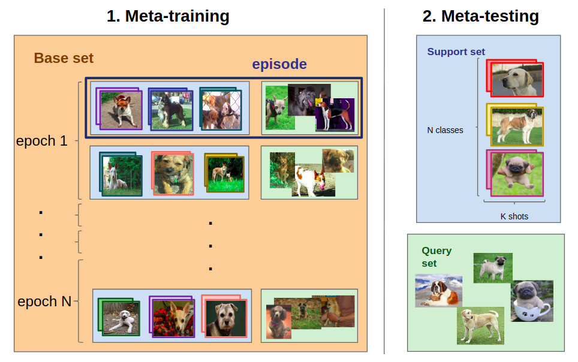  
#### _Common approaches_
- **_Notation_**:
	- Rather than training to recognize specific objects in the training phase, we train the model to learn the similarity and classify/recognize _**N_base**_ classes with _**D_base(Q, S)**_.
	- Then the model can use this knowledge to learn to recognize unseen _**N_novel**_ classes in _**D_novel(Q)**_ based on the provided information from the _**D_test(S)**_.
	- In the case of few-shot learning, a _**meta-learner**_ is trained to learn prior knowledge from **_D_base_**, and then, its parameter is modified with the on a specific task on **_D_novel_** using a _**base-learner**_
- There are **_four common approaches_** to tackle a few-shot learning problem, including:
	+ **Similarity-based approach**: Which focuses on building an efficient similarity distance to identify Query set **_Q_** given labeled Support set **_S_**. The predicted probability of _Q_ is a weighted sum of labels of S samples, with the weight is the similarity distance function between _S_ and _Q_. This approach is quite similar to nearest neighbor algorithms (i.e., k-NN, k-mean clustering).
		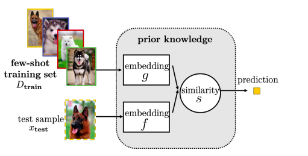  
	+ **Model-based approach**: Which designs a model specifically for fast learning with internal or external memory that can help storage and update its parameter rapidly with a few-training steps.
		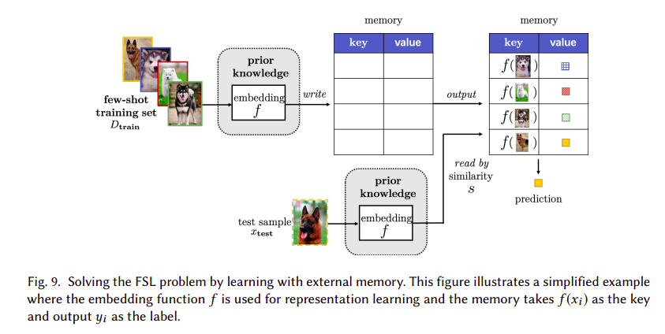  
	+ **Initialization-based approach**: Which focuses on finding a shared initialization learned from _D_base_ that can fast adapt to the unseen tasks from _D_novel_, as the task-specific parameters are close to this global initialization. Then, the learned parameters **_θ_** from the _D_base_ can be fine-tuned into **_ϕ_** on the _D_novel_ dataset for the specific task.
		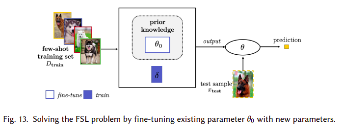  
	+ **Optimization-based approach**: Which focuses on optimizing the meta-learner parameters and the optimization algorithms so that the deep model can be good at learning with only a few examples. The parameter **_θo_** is continuously refined and adjusted by the _meta-learner_ based on the _base_learner_ performance via a few effective gradient descent step. Finally, a specific-task parameter **_ϕ_** is achieved
		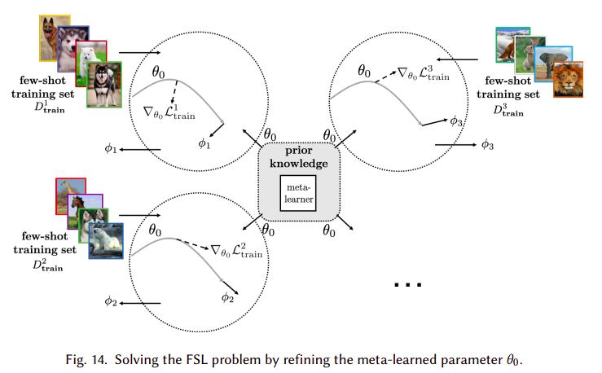
		- Or in some methods, instead of using gradient descent, an optimizer can be learned to output the update **_θo_** directly.
		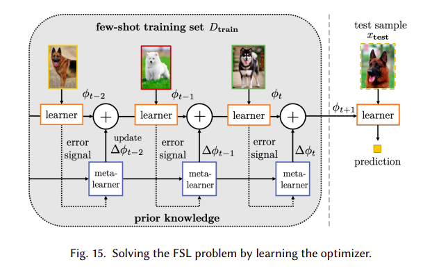  

### Basic Few-shot Learning Algorithms
#### _Siamese Network_
+ **Paper**: https://www.cs.cmu.edu/~rsalakhu/papers/oneshot1.pdf
  
+ **Siamese Network**;
	+ Siamese Network is a twin neural network architecture with two inputs and a distance output for few-shot/one-shot learning
	+ The overall approach is feeding two images **_x1_**, **_x2_** into the siasame network, then these images are passed through _a CNN_ to encode into _feature vectors_ via function **_f0_**
	+ Then, **_L1-distance_** (or other metric such as Cosine) is calculated by **_|f0(x1) - f0(x2)|_**, then the L1-distance is converted into probability **_p_** by a _linear Feedforward and a sigmoid activation_:
		- `p(x1, x2) = sigmoid(W.|f0(x1) - f0(x2)|)`
	+ Finally, the **_cross-entropy loss_** is calculated to learn if two images belong to the same class or not.
	+ Siamese Network can be trained by using **_Triplet Loss_** or **_Contrastive loss_** to augment its performance.
+ **Triplet loss**:
	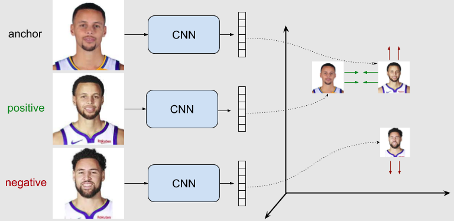  
	+ Given a set of three images [**_Positive_**, **_Anchor_**, **_Negative_**], where the **_Anchor (A)_** and **_Positive (P)_** images belong to the same class, and the **_Negative (N)_** image is different. Thus, the dissimilarity of **_(A, P)_** must be low and **_(A, N)_** must be high.
	+ The Triplet Loss can be calculated by taking the _A_ and comparing it with both _P_ and _N_ by the formula: 
		- `L = max(d[f(A), f(P)] - d[f(A), f(N)] + margin, 0)`  
			- Where **_d[f(A), f(n)]_** is the distance function between two embedding features of A and B, which can be L1, L2, Cosine, etc;  
			- **_margin_** is a small number similar to the bias value which used to "stretch" the distance differences between similar and dissimilar pairs of the triplet.
	+ We must minimize the loss, which push:
		- **_d[f(A), f(P)] −> 0_**
		- **_d[f(A), f(N)] >= d[f(A), f(P)] + margin_**.
		- This means the positive example will be close to the anchor and the negative examples must be far from it. 
+ **Contrastive loss**:
	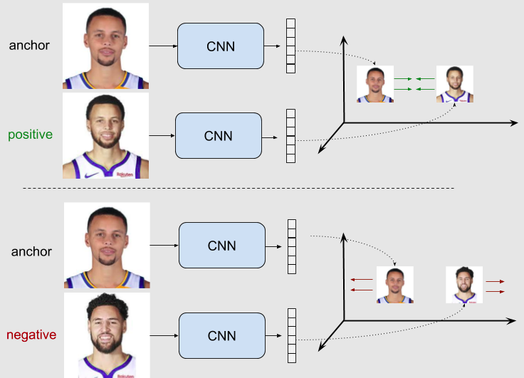  
	- The idea of contrastive loss is quite similar to Triplet Loss. However, it only uses a pair of (image) data, either in the same class or different classes.
	- Given a par of images [A, B], contrastive loss takes the feature extraction of A and calculates its distance to B. If A and B _are in the same class_, then the distance is _minimized_ by the loss, and if otherwise, the distance is _maximized_.
	- During training, A and B are fed to the model with their ground truth relationship **_Y_**. Y equals 1 if A and B are the same class and 0 otherwise. Mathematically, the constative loss is calculated by the formula: 
		- `L = Y*D^2 + (1-Y)*max(margin - D, 0)^2`  
			Where D = _D[f(A), f(A)]_ and the _margin_ is used to "tighten" the constraint: if A and B are dissimilar, then their distance should be at least _margin_ or the contrastive loss will be incurred
+ **Code**: https://github.com/fangpin/siamese-pytorch
+ **Reference**: https://jdhao.github.io/2017/03/13/some_loss_and_explanations/

#### _Matching Network_
+ **Paper**: https://arxiv.org/pdf/1606.04080.pdf  
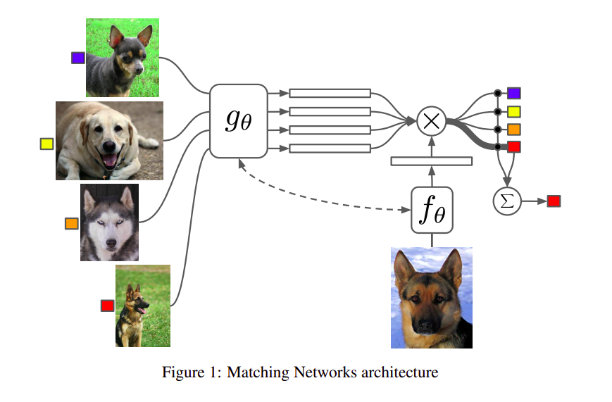  
+ **Approach**:  
	- The idea of Matching Network is given Support set **_S(x_s, y_s)_** and Query set **_Q(x_s)_**, an attention kernel **_a(x_s, x_q)_** is calculated to determined the similarity between **_x_s_** and **_x_q_**. Then, the Query labels **_y_q_** can be calculated by the probability distribution:
		- `y_q = P(y_q|x_p, S) = Sum[a(x_s, x_p)*y_s]`
	- The attention kernel **_a(x_s, x_p)_** between two images is the cosine similarity between their embedding vectors and normalized by the softmax:
		- `a(x_s, x_p) = exp(cosine[f(x_s), g(x_q)])/Sum[exp(cosine[f(x_s), g(x_q)])]`  
			Where **_g_** and **_f_** are the embedding function of the Support and Query set, respectively.
	+ **_Simple version_**: In the simple version of Matching network, an embedding function is a CNN, DNN with single data sample as input (for one-shot learning setting), as **_g == f_**
	+ **_Full Context version_**: For the few-shot learning setting, the Matching Network must take the full Support set **_S_** with _K_ samples as input to match with the Query set Q. Therefore, the embedding function **_g_** and **_f_** are as follow:
		- **_g(x_s, S)_** uses a bidirectional LSTM to encode **_x_q_** in the context of entire support set **_S_**.
		- **_f(x_q, S)_** encode the test sample **_x_q_** via an LSTM with read-attention over the whole set _S_ with the formula:
			- `f(x_q, S) = attLSTM(f'(x_q), g(x_s, S), K)`  
				Where **_f'(x_q)_** is the embedding feature of _x_q_ and _K_ is a fixed number of unrolling steps of the LSTM.
+ **Code**: https://github.com/BoyuanJiang/matching-networks-pytorch

#### _Prototypical Networks_
+ **Paper**: https://arxiv.org/pdf/1703.05175.pdf  
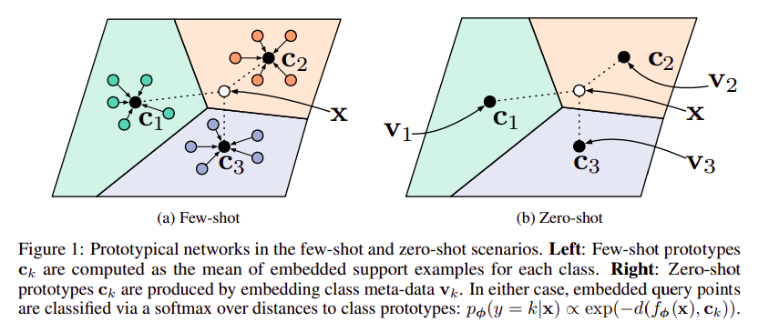  
+ **Idea**:
	+ The objective of Prototypical Networks is to learn _the prototype representation_ on each of **C** classes by calculating the mean of _Support Set_ on an embedding space (which can be done by a simple CNN). These prototype representations are then compared with the _Query Set_ for the Few-shot learning classification task.
	+ The basic idea of Prototypical Networks is quite similar to the K-mean Clustering algorithms.
+ **Approach**:
	+ At first, Prototypical Networks used an embedding function **_f_** (via a CNN) to encode input support set **_S_** into an M-dimensional feature space _(color dot)_. Then, a _prototype feature vector_ **_V_c_** of class **_c_** is calculated by:
		- `V_c = 1/|S_c|*Sum[f(x_k)]` where **_x_k ∈ S_c_**  
			With **_S_c_** is the set of Support set on class **_c_** with **_k_** samples for each
	+ Then, the distribution over classes for given Query input **_Q_** is the softmax over the inverse of distances between the query data embedding _**f(Q)**_ and the prototype vectors **_V_c_** and that can be used as the basis for classification: 
		- `P(y=c|Q) = softmax(-d[f(Q), V_c])` 
		- Therefore, the closer _**f(Q)**_ is to any _**V_c**_, the more likely **Q** is to be in this class.
	+ To optimize the training process, Prototypiccal Networks use the negative log-likelihood **_L = -logP(y = c|Q)_**. The loss computing process is presented in detail below:  
		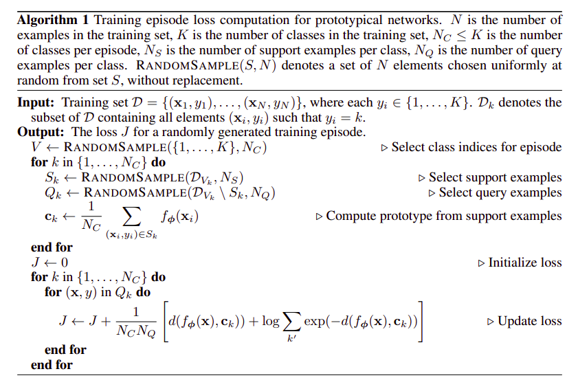  
+ **Code**: https://github.com/orobix/Prototypical-Networks-for-Few-shot-Learning-PyTorch

#### _Model-Agnostic Meta Learning (MAML)_
+ **Paper**: https://arxiv.org/pdf/1703.03400.pdf
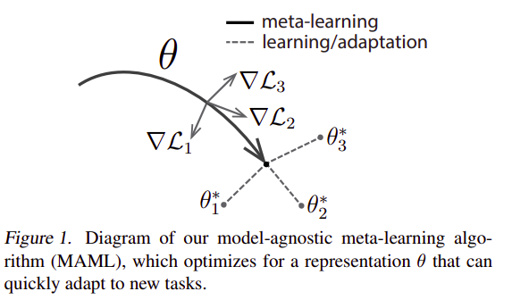  
+ Model-agnostic Meta Learning is an optimization-based approach, which refines the global representation **_θ_** from _meta-learner_ into a specific-tasks **_p(R)_** with parameters **_θ*i_** through a small number of gradient steps with only small amount of support data.
+  **Approach**:
	- Suppose we have a meta-learner model **_f(θ)_** with parameter **_θ_**. Given a task **_ti_** and its associated dataset (**_Di_train_**, **_Di_test_**), the learner model parameters **_θ'_** can be updated by one (or more) gradient descent step updates on task **_ti_** by:
		- `θ'i = θ - α.∇θ.L_ti[f(θ)]`  
			Where **_L_ti_** is the loss of task **_ti_** computed from model **_f(θ)_**, with the step size **α** may be fixed as a hyperparameter
	- The model parameters are then trained by optimizing the performance of **_f(θ'i)_** which respect to **_θ_** across tasks sample from **_p(R)_**. Then, the meta-objective _**θ***_ is calculated by:
		- `θ* = argmin[Sum(L_ti[f(θ'i)])]`
	- Note that the meta-optimization is performed over the meta-model parameter **_θ_**, whereas the objective _**θ***_  is computed using the updated model parameter **_θ'_**. In the paper, the meta-optimization across tasks is performed via SGD algorithm:
		-	`θ <− θ - β.∇θ.Sum(L_ti[f(θ'i)])`  
			where **_β_** is the step size
	- The detail of MAML full algorithms is presented in detail below:
		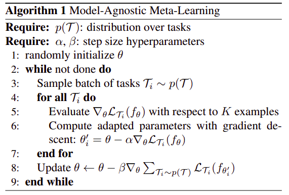  
+ **Code**: https://github.com/cbfinn/maml

### **Specific topic**
+ [**_Image Classification_**](https://github.com/quanghuy0497/Few-shot_Learning_Papers/tree/main/Few-shot%20Image%20Classification): To be updated
+ [**_Object Detection_**](https://github.com/quanghuy0497/Few-shot_Learning_Papers/tree/main/Few-shot%20Object%20Detection): To be updated
+ [**_Object Segmentation_**](https://github.com/quanghuy0497/Few-shot_Learning_Papers/tree/main/Few-shot%20Object%20Segmentation): To be updated

### **References**
+ https://github.com/Duan-JM/awesome-papers-fewshot#cv (**papers**, **recourse**, **repo**, **blog**,...)
+ https://github.com/sudharsan13296/Awesome-Meta-Learning (**paper**, **code**)
+ https://github.com/yassouali/awesome-semi-supervised-learning (**paper**, **code**)
+ Few-Shot Learning by Shusen Wang:
	- Basic concept: https://www.youtube.com/watch?v=hE7eGew4eeg
	- Siamese Networks: https://www.youtube.com/watch?v=4S-XDefSjTM
	- Pretraining & Fine-tuning: https://www.youtube.com/watch?v=U6uFOIURcD0
+ Meta-Learning: Learning to Learn Fast: https://lilianweng.github.io/lil-log/2018/11/30/meta-learning.html
+ Understanding Few-shot lerning in CV: https://neptune.ai/blog/understanding-few-shot-learning-in-computer-vision
+ Meta-learning algorithms for Few-Shot Computer
Vision: https://arxiv.org/pdf/1909.13579.pdf
+ A Concise Review of Recent Few-shot Meta-learning Methods: https://arxiv.org/pdf/2005.10953.pdf
+ Generalizing from a Few Examples: A Survey on Few-Shot
Learning: https://arxiv.org/pdf/1904.05046.pdf
+ On Episodes, Prototypical Networks, and Few-Shot Learning: https://arxiv.org/pdf/2012.09831.pdf

  
  
These notes were created by [quanghuy0497](https://quanghuy0497.github.io/)@2022